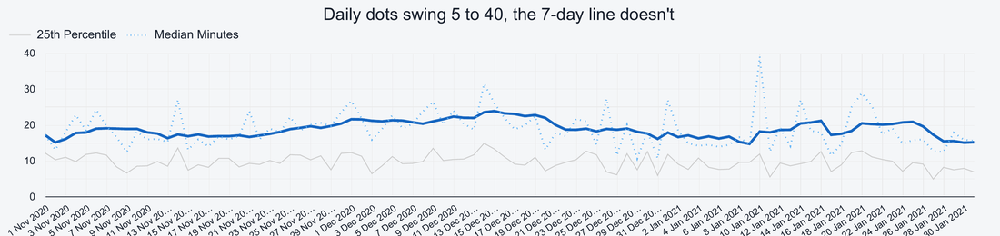
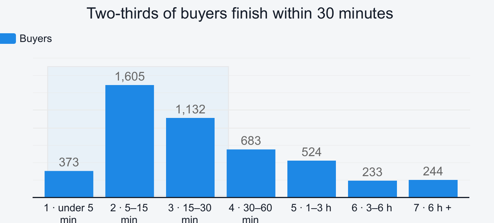
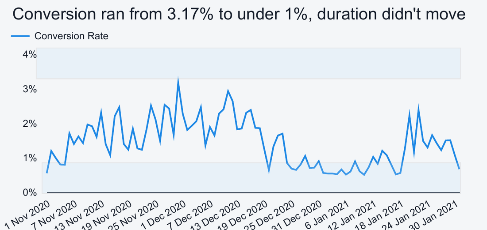
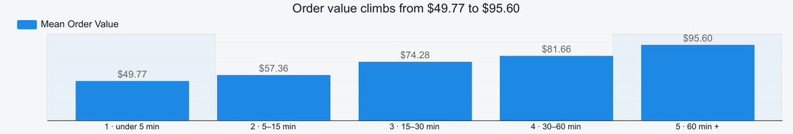
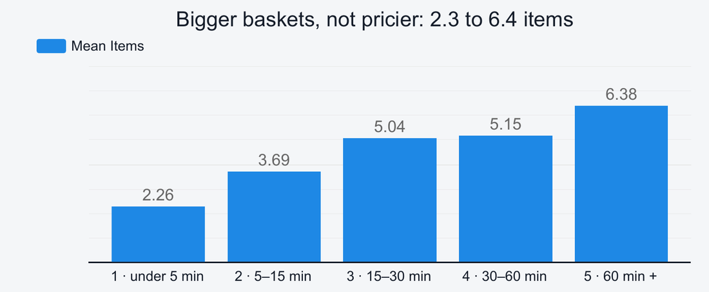
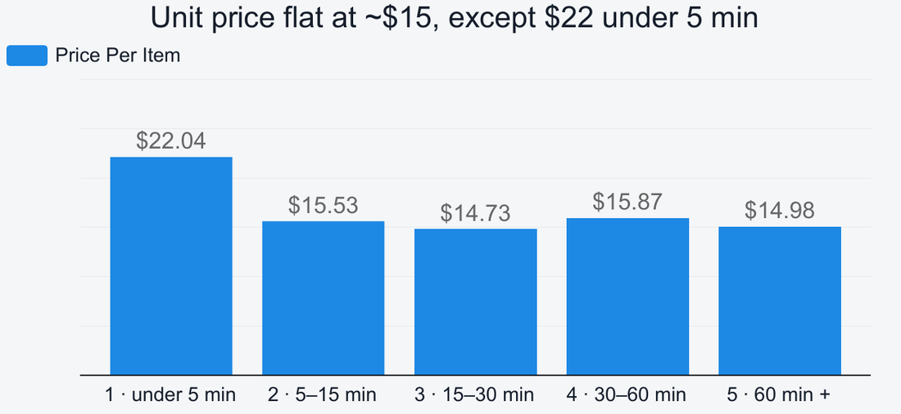
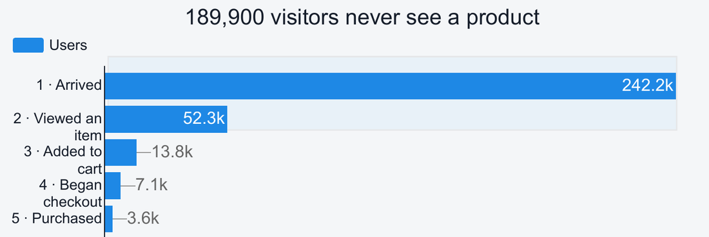
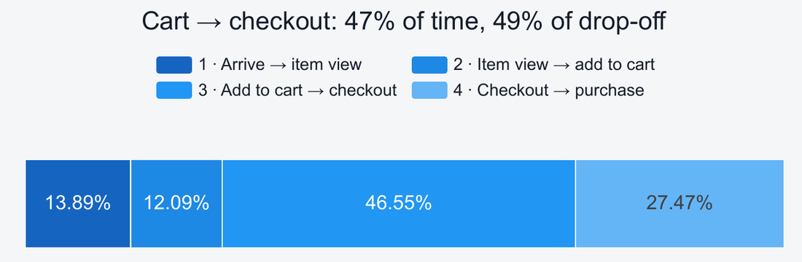
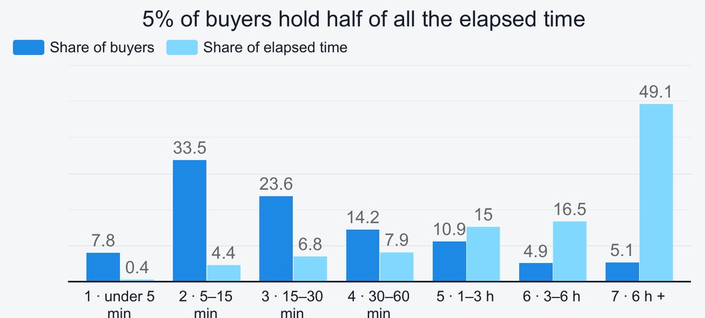

[README.md](https://github.com/user-attachments/files/31836222/README.md)
# Time to First Purchase

**How long does it take someone to buy, and is that a number worth managing?**

Self-directed [Product analysis](https://datastudio.google.com/s/kZ7BxVQoD_s) of the [**public GA4 sample e-commerce dataset**](https://docs.google.com/spreadsheets/d/1NIraeukk8y9geBQEWABPiL7rXrhM5DL-rmTruKFEPtQ/edit?gid=1350506920#gid=1350506920) (Google Merchandise Store, 1 Nov 2020 to 31 Jan 2021), framed around a realistic product question. Fully reproducible: the queries run against `bigquery-public-data` as written.

`BigQuery` · [SQL](https://github.com/AgateE1/Session-Length-and-Order-Value/tree/main/SQL%20queries) · Looker Studio ·  GA4 event data · `window functions` · `statistical testing`

---

## The finding

Half of same-day buyers purchase within **19.1 minutes** of arriving, and that has not moved in three months, including through the largest demand swing in the data.

The stability is the finding, not a disappointment. Three things follow from it:

1. **It is not an early-warning metric.** Conversion peaked at 3.17% on Black Friday week and fell to a fraction of that by January, while daily buyer volume went from ~150 a day to under 20. The median time to purchase did not move with either. A metric that ignores the biggest swing in the data will not warn you about the next one.

2. **It mostly measures basket size, not friction.** Order value climbs 1.9× from the fastest buyers to the slowest, and the entire gap is more items rather than pricier ones. Driving this number down would mean shrinking baskets.

3. **The losses worth acting on are elsewhere.** 78% of visitors leave without viewing a single product, and the add-to-cart to checkout step consumes 47% of journey time while losing 49% of the people who reach it.

---

## The question

> *How much time does it take a user to make a purchase, measured from first arriving on the site to their first purchase that same day, and how does that duration progress daily?*

Three definitions shape everything that follows:

- **The unit is the user-day**, not the person. Someone who buys on three days appears three times. The 4,794 figure is 4,794 user-days.
- **Same-day only, by construction.** Anyone who researches on Monday and buys on Thursday is absent from the data entirely, not recorded as a long duration.
- **Median, not mean.** The distribution is severely right-skewed: median 19.1 minutes against a mean of 74.7.

---

## 1 · The level, and the daily progression



The thick line is a 7-day trailing average of the daily median; the dotted line is the raw daily figure; the grey line is the 25th percentile.

The smoothed line sits in a narrow band across all 92 days. The dotted line swings widely, but that is sample size rather than behaviour: some January days rest on fewer than two dozen buyers, and a median built on fifteen people moves several minutes if one or two of them behave differently.

Two-thirds of buyers finish inside half an hour. The most common band is 5 to 15 minutes, not the fastest one, so the typical pattern is a short but real browse rather than someone arriving already decided.



**The contrast is what makes the flat line useful:**



Demand, traffic quality and conversion all moved substantially over this quarter. The time to purchase did not move with them.

---

## 2 · What the metric is actually measuring



Order value climbs from $49.77 in the fastest band to $95.60 in the slowest. An order's value is item count multiplied by item price, so decomposing it settles what drives that:

| | |
|---|---|
|  |  |

**Items per order nearly triples** (2.26 to 6.38) while **price per item stays flat** at roughly $15 across four of the five bands. The two columns multiply back to the order values within a few cents, so the entire $46 gradient is basket size. Slower buyers are not trading up to more expensive products. They are putting more of the same products in the basket.

One oddity: the fastest band inverts the pattern, with the smallest basket (2.26 items) but the highest unit price ($22.04). That is a distinct behaviour, someone arriving for one specific expensive item, not a hurried version of everyone else.

### Two readings, and what would separate them

The correlation is not in doubt. Its interpretation is, and this data cannot resolve it.

**A. Duration signals intent.** Long sessions are people browsing a category and assembling a basket. The minutes are engagement, and compressing them would remove the browsing that fills the cart.

**B. Duration is a by-product of basket size.** Six items mechanically take longer to add than two, at about $15 either way. Duration then carries nothing that basket size does not carry more directly.

Both predict exactly the observed chart. **The test that would separate them:** hold items-per-order constant and re-examine. If a four-item order is still worth more at 60 minutes than at 5, something beyond mechanics is operating.

Both readings agree on one thing, which is the practical conclusion: **this is not a number to drive down.** On reading A you would cut the browsing that fills baskets; on reading B you would simply be setting a target to shrink baskets.

---

## 3 · Where the losses actually are

| | |
|---|---|
|  |  |

**189,900 of 242,200 visitors leave without viewing a single product.** In absolute terms that dwarfs every other funnel step combined, and no amount of checkout work touches it.

**Add-to-cart to checkout consumes 46.6% of journey time and loses 48.6% of the users who reach it.** It is the only stage where a large time cost and a large drop-off coincide, and that is what makes it the one worth investigating. Everywhere else in this analysis, reducing time risks removing the browsing that fills baskets. Here the basket is already assembled, so the time is unlikely to be people adding items.

---

## Analytical decisions

The parts of this project I would want to be asked about.

### Building an idle-stripped time measure

Elapsed time from first event to purchase is misleading, because a user who visits at 09:00 and returns at 17:00 records an eight-hour purchase. For the order value analysis that would have been fatal: the whole gradient could be dismissed as people leaving a tab open.

So section 2 uses **engaged time** instead. Each gap between a user's consecutive events is capped at 30 minutes, GA4's own session timeout, and summed to the first purchase:

```sql
LEAST(
  IFNULL(
    event_timestamp - LAG(event_timestamp)
      OVER (PARTITION BY user_pseudo_id, event_date ORDER BY event_timestamp),
    0),
  30 * 60 * 1000000) AS active_gap_us
```

The effect: **the mean falls from 74.7 minutes to 30.1 while the median holds at 19.08.** That gap is the measurement problem, quantified. It makes the value finding stronger rather than weaker, because someone in the 60-minute band genuinely spent an hour actively shopping.

### Testing whether a data quality issue invalidated the result

403 buyer-days are excluded from the value analysis because their purchase records no revenue. Finding that is routine. The question that mattered was whether the exclusion was *selective*, because if slow buyers were disproportionately missing, the whole gradient would be an artefact.

The excluded group's median is **20.2 minutes against 18.9** for the group kept: a difference of 1.3 minutes on a sample of 398, where the standard error of that median is 1.6 (**p = 0.43**, 95% CI −2.0 to +4.6). The median and the mean also move in *opposite* directions between the two groups, which is what noise looks like rather than a systematic difference.

Conclusion: the gap costs sample size, not validity. Section 2 stands, and can be defended.

### Choosing a weighting, and saying why

The journey-stage percentages could be computed two ways, and they answer different questions:

```sql
ROUND(100 * AVG(leg / total), 1) AS pct_of_journey   -- every buyer weighted equally
-- versus SUM(leg) / SUM(total)                      -- the slow tail dominates
```

The question is where a *typical* journey's time goes, not where the aggregate clock goes. Given that 5% of buyers hold 49% of all elapsed time, the second version would have been a description of the tail wearing the label of an average.

### Dropping bad rows rather than averaging through them

Events can arrive out of order, so a user's four journey legs do not always sum to their total journey time. Rather than let those distort the averages, they are dropped by an explicit consistency check:

```sql
WHERE total > 0 AND ABS(leg1 + leg2 + leg3 + leg4 - total) < 0.02
```

Negative legs are separately clamped with `GREATEST(x, 0)`, so one out-of-order journey cannot drag a stage average below zero.

### Reporting a negative result as a useful one

The honest answer to the question asked was "the number does not move." That is easy to bury. Framed properly it is the most actionable finding in the project: a metric that ignored a 6× swing in conversion should not be on a dashboard being watched for early warning, and a metric that tracks basket size should not have a reduction target set on it.

### Not over-claiming

Section 2 sets out two readings of the value gradient and states plainly that this data cannot separate them, along with the specific test that would. Both readings happen to converge on the same recommendation, which is what makes the conclusion safe to act on without resolving the ambiguity.

### Architecture

Six independent queries, each feeding its own Looker Studio data source, rather than one chained pipeline. Each recalculates what it needs from the raw events. That costs some repetition and buys isolation: a change or a failure in one chart cannot silently corrupt another. Two of the six hardcode their date window because they describe the whole quarter; the rest are driven by the report's date control.

---

## What the data cannot tell you

**A day is not a session.** The measurement runs from the first event of the calendar day.



5.1% of buyers hold 49.1% of all elapsed time, and that tail is what pulls the mean to 74.7 against a median of 19.1. Those durations are largely gaps between visits, so the slow bands should not be read as patient, high-consideration shoppers. Section 2 addresses this directly with engaged time; sections 1 and 3 do not, and are read with the caveat in place.

**Other limitations**, set out in the [full report](report/analytical-report.md): the same-day restriction is a definitional ceiling on the headline number, the period is a holiday quarter and will not generalise, nothing is split by device or channel, and add-to-cart tracking was absent for 18 days in November.

**What I would do differently.** The single cheapest improvement would have been to split the median by device and traffic source from the start. A pooled 19 minutes is equally consistent with one population or with 8 minutes on desktop and 40 on mobile, and those imply completely different product work.

---

## Recommendations

1. **Do not set a target on time to first purchase.** Under either reading, driving it down means shrinking baskets.
2. **Do not treat slow buyers as a problem.** They carry the largest baskets and the highest order values.
3. **Prioritise the cart to checkout stage.** Instrument it before specifying a fix; the events between those two steps are not currently tracked.
4. **Treat the pre-product-page loss as a separate, larger workstream.** 189,900 people, and nothing downstream touches it.
5. **If a friction metric is wanted, use time to first add-to-cart.** It ends before basket assembly begins, so it measures decision speed rather than shopping volume, and unlike this metric it can legitimately be optimised downward.

---

## Repo contents

| path | what it is |
|---|---|
| [`sql/`](sql/) | the six production queries |
| [`sql/README.md`](sql/README.md) | line-by-line documentation of all six, with the shared patterns explained once |
| [`report/analytical-report.md`](report/analytical-report.md) | full write-up: objective, methodology, findings, limitations, recommendations |
| [`presentation/`](presentation/) | 12-slide deck |
| [`images/`](images/) | dashboard pages and individual charts |

**Data:** `bigquery-public-data.ga4_obfuscated_sample_ecommerce.events_*`, the public GA4 sample export. One row per event, with no orders, sessions or users table, so every construct is derived from the event stream. The queries run as written, no setup beyond a BigQuery project to bill.

**Dashboard:** three pages, each answering one question.

| page | question | answer |
|---|---|---|
| [1](images/dashboard-page-1.png) | How long does it take, and is it moving? | 19 minutes, and no |
| [2](images/dashboard-page-2.png) | What is the metric actually measuring? | Basket size, not friction |
| [3](images/dashboard-page-3.png) | So where should we look instead? | Before the product page, and at checkout |
